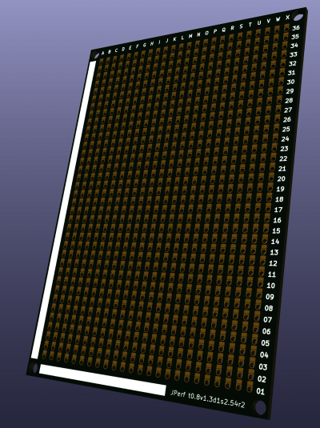
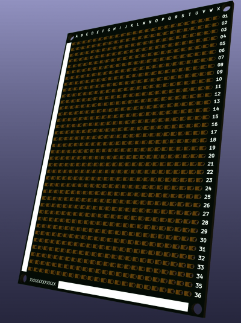

# JPerf
JPerf is a collection of open source prototyping/utility
printed circuit boards featuring matrix/routed layouts for quick
and durable prototyping.

All JPerf projects are distributed under the terms of the CERN
Open Hardware License (Strongly Reciprocal) version 2 or later.
Please reference the [LICENSE](LICENSE.txt) file in this repository for all terms and conditions.

KiCad 6 or later is generally required to work with the source files in this
repository.

## Boards

### JPerf t0.8v1.3d1s2.54 (revision 2)

Located at [src/t0.8v1.3d1s2.54](src/t0.8v1.3d1s2.54).

* Outside Dimensions
  * 68mm by 100mm
  * 24 PTH by 36 PTH
* Mounting Holes
  * Non-plated 3mm Dia., 0.5 by 0.5mm equidistant from outside edges.
* Track width
  * 0.8mm
* Drill/Via
  * 1.3mm/1mm
* Via Pitch
  * 2.54mm (100mil, standard 1/10th inch)
* Row Pitch
  * 2.54mm (100mil, standard 1/10th inch)

Please see project releases for gerbers, when available. (This includes gerbers validated for direct submission
to common board houses, when available).
